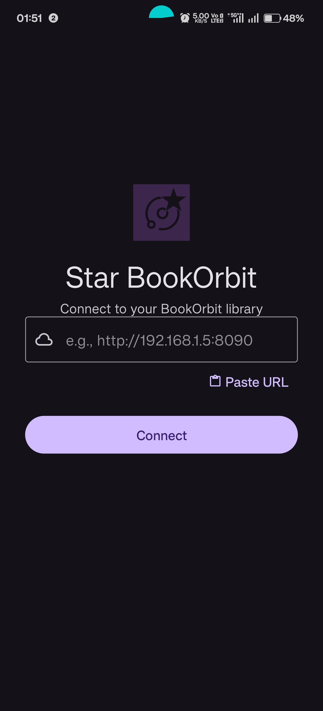
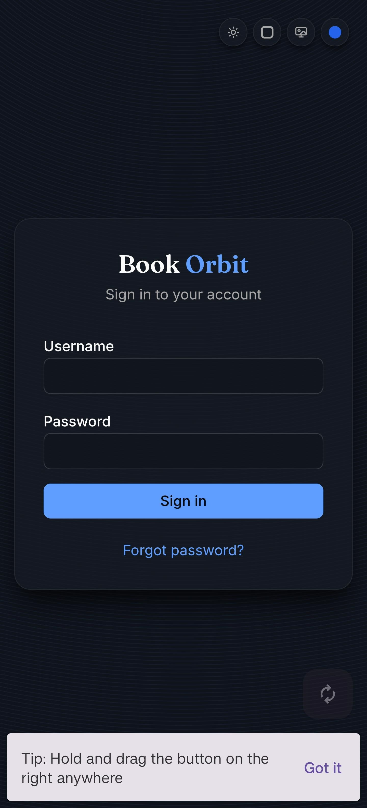
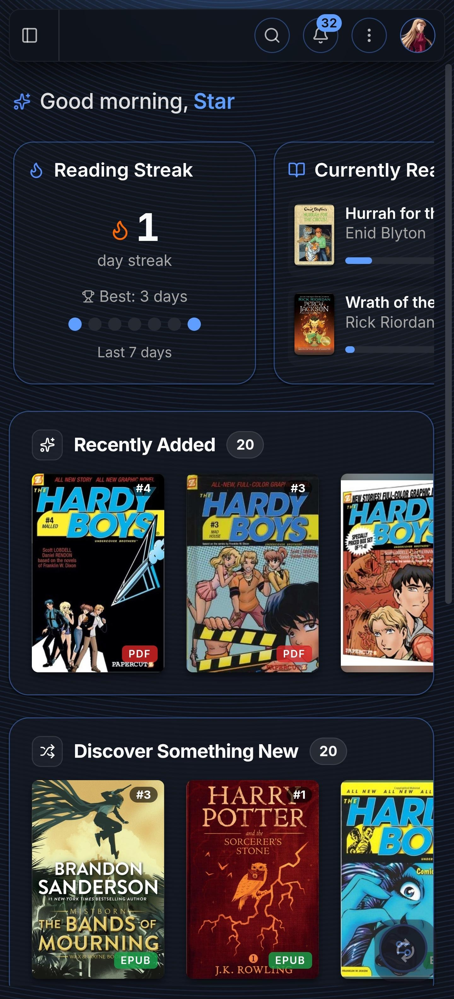
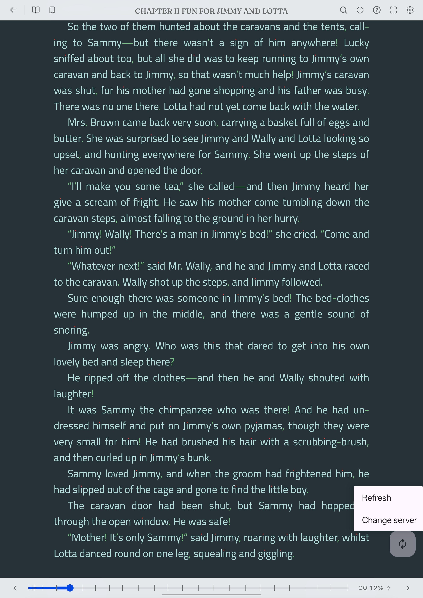
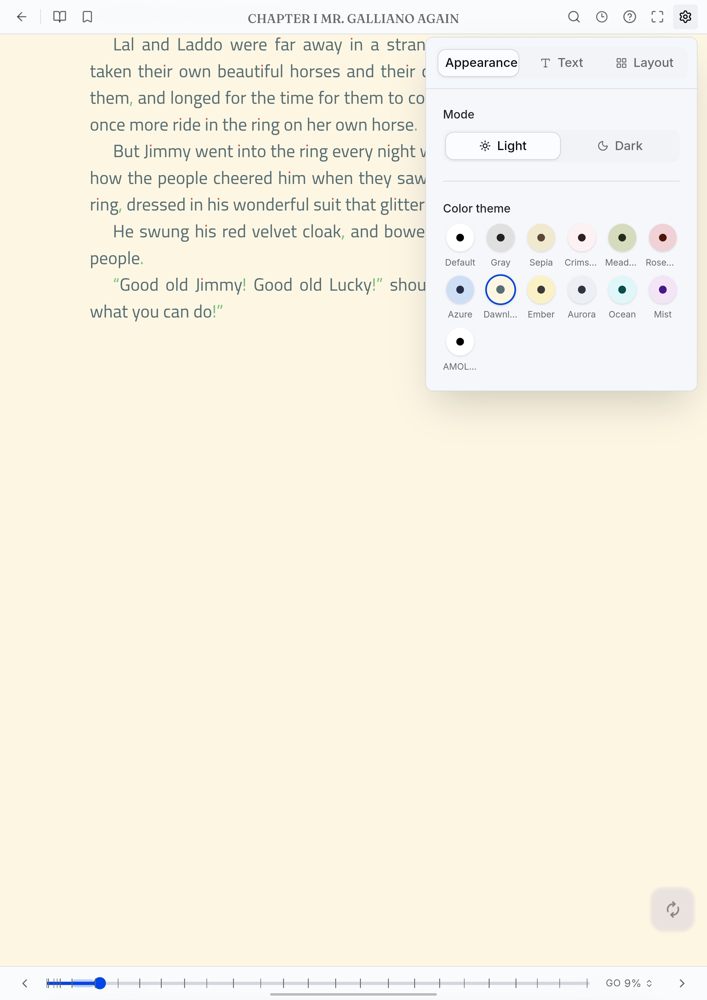
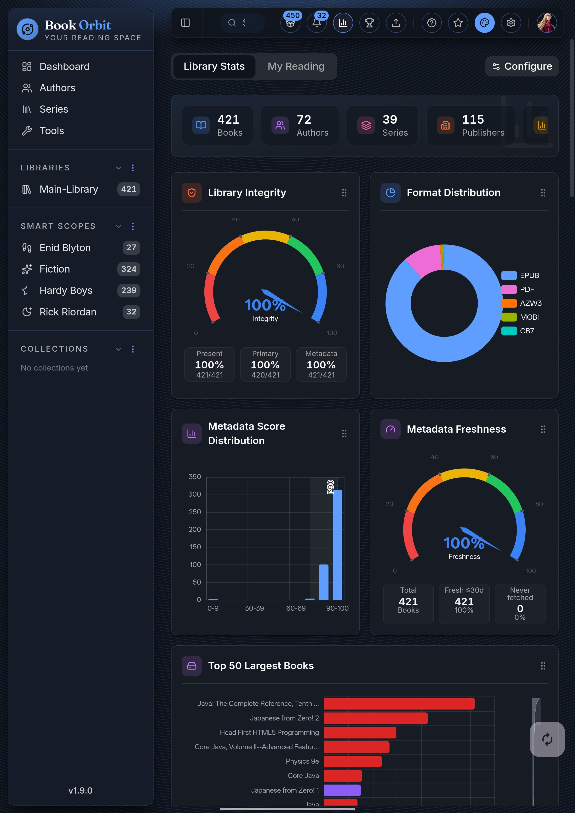

# Star-BookOrbit — BookOrbit Android Client

A clean, open-source Android client for your self-hosted [BookOrbit](https://github.com/every-day-things/book-orbit) library.

No browsers, tracking, ads, or accounts. Just your books. And a feature rich book reader.

---

## Why Star-BookOrbit?

BookOrbit's web UI and the built-in reader is excellent — but opening it in a browser means living with tabs, address bars, and the browser stealing your back button. Star-BookOrbit wraps it in a proper Android app so it behaves like one.

| Without Star BookOrbit                                                        | With Star BookOrbit                                                                              |
|-------------------------------------------------------------------------------|--------------------------------------------------------------------------------------------------|
| Browser toolbar takes up screen space                                         | Full screen reading experience                                                                   |
| Back button closes the tab                                                    | Back navigates inside your library                                                               |
| Session mixed with browser cookies                                            | Isolated, always stays logged in                                                                 |
| "Add to homescreen" still shows browser chrome                                | Real app icon, real app. Works with http also if you are self-hosting (or using Tailscale, etc.) |
| Loses your server URL on browser clear                                        | Remembers your server permanently                                                                |
| Reading stats are not instant or reliable                                     | Built-in reading stats give complete, clean, in-depth details                                    |
| Browser needs to be opened, your tab needs to be tracked by you               | Directly open your BookOrbit app and start browsing your books, low memory footprint             |
| You've to use additional OPDS apps, where two way sync is not always possible | Two-way sync is built in as you are using the BookOrbit built-in reader itself                   |

---

## Screenshots

<p align="left">
  
  &nbsp;&nbsp;&nbsp;&nbsp;
  
  &nbsp;&nbsp;&nbsp;&nbsp;
  
  &nbsp;&nbsp;&nbsp;&nbsp;
</p>

<br>

<p align="left">
  
  &nbsp;&nbsp;&nbsp;&nbsp;
  
  &nbsp;&nbsp;&nbsp;&nbsp;
  
  &nbsp;&nbsp;&nbsp;&nbsp;
  
</p>

<br>

<p align="left">
  <video src="https://github.com/user-attachments/assets/b4fa9dc0-3791-45af-8a47-9c4213735a2f" width="250" controls aria-label="Audiobook Preview">
  Sorry, your browser doesn't support embedded videos.
  </video>
</p>

---

## Features

- **Zero Browser Chrome:** True edge-to-edge reading. No address bars, nor bottom navigation tabs.
- **HTTP, HTTPS & Tailscale Friendly:** Bypasses standard PWA HTTPS restrictions, easily handling raw local IPs and custom ports.
- **Draggable Utility Button:** A transparent, movable FAB that stays out of the way of your book text while giving you quick access to refresh or disconnect.
- **Encrypted Caching:** Your server URLs and connection strings are secured locally using Android's `EncryptedSharedPreferences`.
- **Universal Compatibility:** Built perfectly for BookOrbit, but naturally supports any responsive self-hosted media server (Kavita, Audiobookshelf, Komga) (Future Roadmap).
- Remembers your BookOrbit server URL across restarts
- Full Material Design 3 with dynamic color (Android 12+)
- Automatic dark/light mode following system settings
- Zero telemetry, zero analytics, zero accounts
- FOSS
---

## Getting Started

### Prerequisites

- Android 8.0+ (API 26)
- A running [BookOrbit](https://github.com/bookorbit/bookorbit) instance accessible from your phone (the url:port should be your own BookOrbit address)
  - Local network: `http://192.168.x.x:8090`
  - Remote (e.g. via Tailscale): `http://100.x.x.x:8090`
  - Public HTTPS (e.g. via Cloudflare or nginx): `https://your-device.ts.net`

### Install

Download the latest APK from [Releases](../../releases) and sideload it, or build from source below.

(Or add it to your [Obtainium](https://github.com/ImranR98/Obtainium)/[ObtainX](https://github.com/Diegoprofeta/ObtainX))

### Build from source

```bash
git clone https://github.com/Star-Trowa/StarBookOrbit.git
cd StarBookOrbit
./gradlew assembleRelease
```

---

## Usage (3 easy steps)

1. Open Orbit — enter your BookOrbit server URL on first launch
2. Tap **Connect** — your library opens full screen
3. The small floating button gives you **Refresh** and **Change server**

**Tip**: Drag the button anywhere on screen to keep it out of the way when reading books

**Note**: If you use any proxy or VPN, make sure to turn it on before connecting in the app.

---

## Roadmap

- [ ] Multiple saved server URLs
- [ ] Theme override (force light/dark independent of system)
- [ ] Support for Audiobookshelf and Kavita
- [ ] F-Droid release

---

## Contributing

PRs welcome. Please follow _clean_ coding practices, and the existing architecture — SOLID principles, clean separation between `data`, `domain`, and `presentation` layers.

Also, try to aim for adding test coverage for the code added/edited.

---

## License

MIT — do whatever you want with it.

