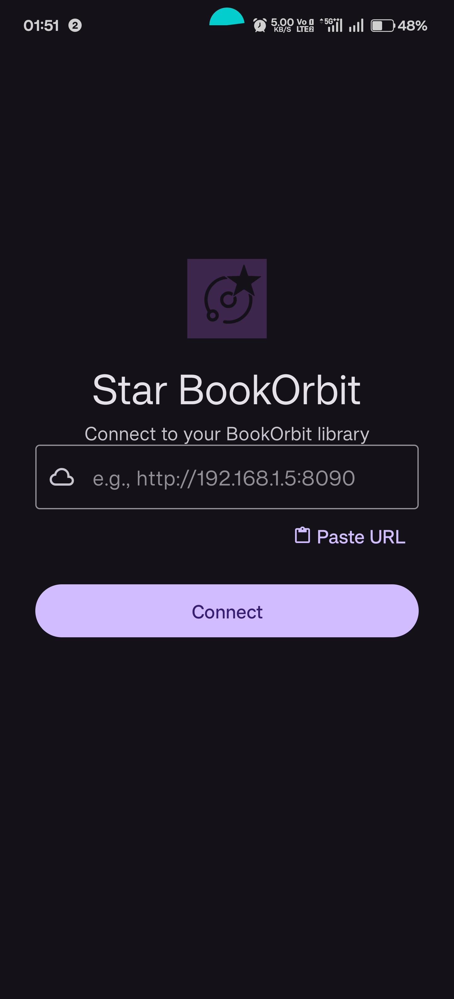
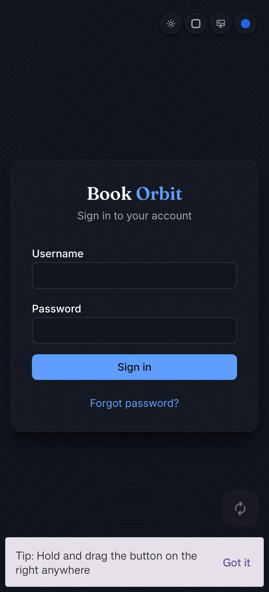
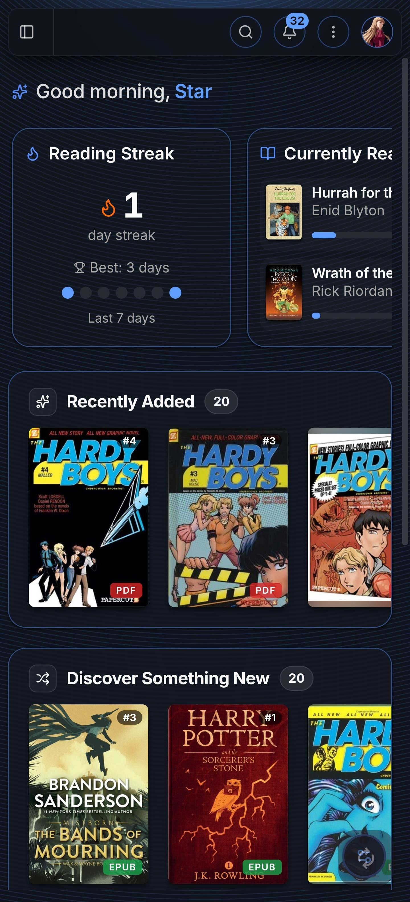
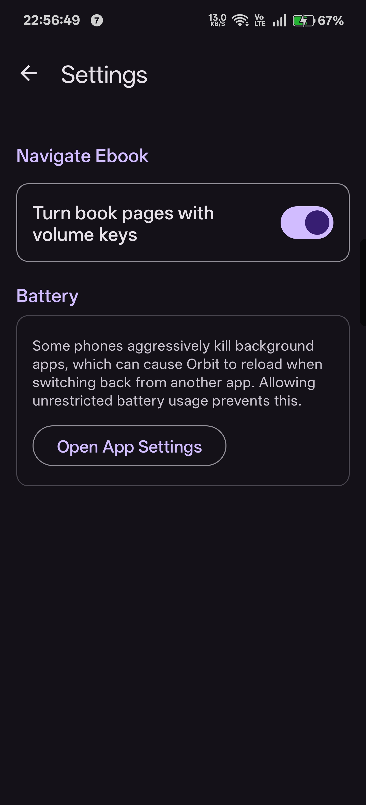
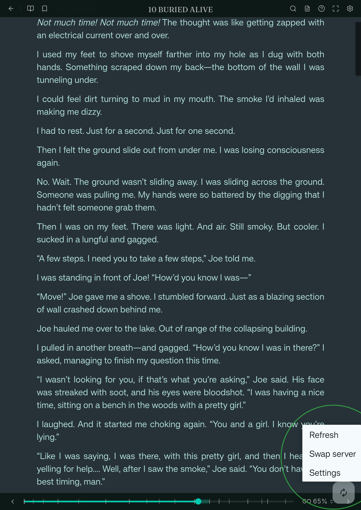
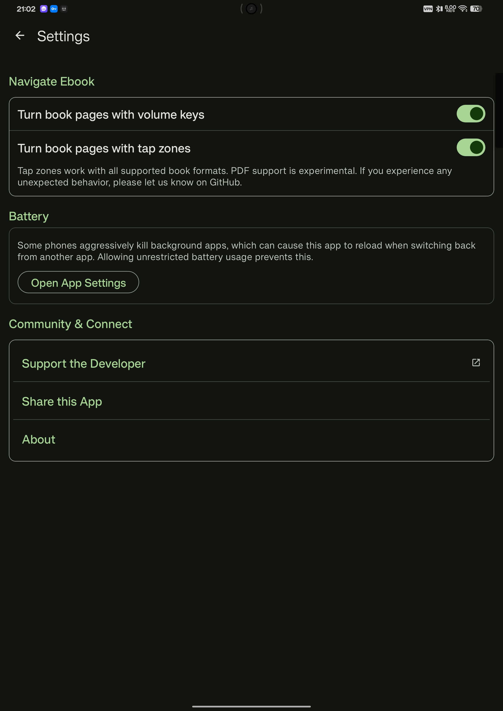
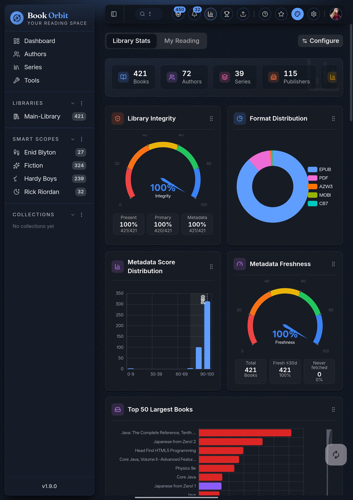

# Star-BookOrbit — BookOrbit Android Client

<a href="https://github.com/Star-Trowa/StarBookOrbit/stargazers"></a>
<a href="https://github.com/Star-Trowa/StarBookOrbit/releases"></a>
<a href="https://github.com/Star-Trowa/StarBookOrbit/releases/latest"></a>
<a href="https://github.com/sponsors/Star-Trowa">

</a>
<a href="https://github.com/Star-Trowa/StarBookOrbit/blob/main/LICENSE"></a>

A clean, open-source Android client for your self-hosted [BookOrbit](https://github.com/bookorbit/bookorbit) library.

No browsers, tracking, ads, or accounts. Just your books. And a feature rich book reader.

---

## Why Star-BookOrbit?

BookOrbit's web UI and the built-in reader is excellent — but opening it in a browser means living with tabs, address bars, and the browser stealing your back button. Star-BookOrbit wraps it in a proper Android app so it behaves like one.

| Feature | Without Star-BookOrbit                                                                          | With Star-BookOrbit                                                                              |
| :--- |:------------------------------------------------------------------------------------------------|:-------------------------------------------------------------------------------------------------|
| **Interface** | Cluttered with browser toolbars                                                                 | Immersive, full-screen reading                                                                   |
| **Navigation** | Device back button often closes the tab                                                         | Native back navigation within your library                                                       |
| **Session** | Mixed cookies; sessions can expire                                                              | Isolated environment; stays logged in                                                            |
| **Integration** | “Add to homescreen” still shows browser UI                                                      | Dedicated app icon and interface; works with HTTP, self-hosting, and Tailscale                   |
| **Data Retention** | Clearing browser data can wipe your server URL                                                  | Remembers your server configuration                                                              |
| **Access & Performance** | Cumbersome tab management; higher memory usage                                                  | One-tap access to your books; low memory footprint                                               |
| **Sync & Stats** | Relies on OPDS apps; two-way sync may be delayed or unreliable, with limited reading statistics | Built-in two-way sync with instant, in-depth reading statistics direct from the BookOrbit reader |
| **Hardware Controls** | Touch-only / basic native page navigation                                                       | Hardware volume keys and tap zones supported for page turning                                    |
---

## Screenshots

<p align="left">
  
  &nbsp;&nbsp;&nbsp;&nbsp;
  
  &nbsp;&nbsp;&nbsp;&nbsp;
  
  &nbsp;&nbsp;&nbsp;&nbsp;
  
  &nbsp;&nbsp;&nbsp;&nbsp;
</p>

<br>

<p align="left">
  
  &nbsp;&nbsp;&nbsp;&nbsp;
  
  &nbsp;&nbsp;&nbsp;&nbsp;
  
  &nbsp;&nbsp;&nbsp;&nbsp;
  
</p>

<br>

<p align="left">
  <video src="https://github.com/user-attachments/assets/b4fa9dc0-3791-45af-8a47-9c4213735a2f" width="250" controls aria-label="Audiobook Preview">
  Sorry, your browser doesn't support embedded videos.
  </video>
</p>

---

## Features

- **Native Android Reading Experience:** Full-screen, edge-to-edge reading with no browser address bars, tabs, or browser UI.
- **Built-in BookOrbit Reader:** Read directly through the BookOrbit reader with its built-in two-way sync and reading statistics, instead of using a separate ebook app.
- **HTTP, HTTPS & Tailscale Friendly:** Connect to local IP addresses, custom ports, plain HTTP, HTTPS, or BookOrbit instances accessed through Tailscale.
- **Persistent Server Configuration:** Your BookOrbit server URL is securely stored and remembered across app restarts.
- **Encrypted Local Storage:** Server URLs and connection data are protected using Android's `EncryptedSharedPreferences`.
- **Draggable Utility Button:** A translucent, movable floating button (FAB) provides quick access to refresh, switch servers, and settings without getting in the way of your reading.
- **Hardware Page Controls:** Use your device's _volume keys_ or _tap zones_ to move between ebook pages for convenient, ergonomic navigation.
- **Material You Dynamic Colors:** Automatically adapts to your system color palette on Android 12+ for a native, personalized experience.
- **Audiobook Support:** Listen to audiobooks directly through the app, including background playback.
- **Lightweight & Focused:** Designed specifically for self-hosted BookOrbit without unnecessary browser overhead.
- **FOSS & Private:** 100% free and open-source. Zero telemetry, zero analytics, zero ads, and no accounts required.

---

## Getting Started

### Prerequisites

- Android 8.0+ (API 26)
- A running [BookOrbit](https://github.com/bookorbit/bookorbit) instance accessible from your phone (the **url:port** should be your own BookOrbit address). For example:
  - Local network: `http://192.168.x.x:8090`
  - Remote (e.g. via Tailscale): `http://100.x.x.x:8090`
  - Public HTTPS (e.g. via Cloudflare or nginx or Tailscale funnel): `https://your-device.ts.net`

`StarBookOrbit is a community project and is not affiliated with or maintained by BookOrbit.`
### Install

Download the latest APK directly:

[](https://github.com/Star-Trowa/StarBookOrbit/releases/latest)

<a href="https://apps.obtainium.imranr.dev/redirect.html?r=obtainium://add/https://github.com/Star-Trowa/StarBookOrbit">

</a>

### Build from source

```bash
git clone https://github.com/Star-Trowa/StarBookOrbit.git
cd StarBookOrbit
./gradlew assembleRelease
```

---

## Usage (3 easy steps)

1. Open StarBookOrbit — enter your BookOrbit server URL on first launch
2. Tap **Connect** — your library opens full screen
3. The small floating, translucent button gives you **Refresh**, **Swap server** and **Settings**

**Tip**: Drag the button anywhere on screen to keep it out of the way when reading books

**Note**: If you use any proxy or VPN for your BookOrbit, make sure to turn it on before connecting in this app.

---

## Troubleshooting
### 1. Audio pausing in the background?
Android's battery optimization might kill the app while you are listening with the screen off. To fix this:
- In app, go to Settings > Battery
- Update the battery settings to unrestricted

OR

- Long-press the StarBookOrbit app icon and tap App Info (the ⓘ button).
- Tap on App battery usage (or just Battery).
- Change the setting from "Optimized" to "Unrestricted".

### 2. Volume keys not working to navigate the pages?
The setting need to be enabled first to turn pages using volume keys. To enable this:
- In app, go to Settings > Navigate Ebook
- Change the toggle to enable(or disable) navigation via the volume keys

### 3. Tap to navigate not turning the pages?
The setting need to be enabled first to use tap-zones for navigation. To enable this:
- In app, go to Settings > Navigate Ebook
- Change the toggle to enable(or disable) navigation via the tap-zones

---

## Roadmap

- [x] Use volume keys to navigate between pages
- [x] Material You dynamic colors — the app automatically adapts to your phone’s system color palette on Android 12+ for a more native, personalized reading experience
- [x] Add option to navigate via tap besides swipe
- [ ] Multiple saved server URLs
- [ ] Theme override (force light/dark independently of system settings)
- [ ] Support for Audiobookshelf and Kavita
- [ ] F-Droid/Droidify release


---

## Contributing

PRs welcome. Please follow _clean_ coding practices, and the existing architecture — SOLID principles, clean separation between `data`, `domain`, and `presentation` layers.

Also, try to aim for adding test coverage for the code added/edited.

---

## License

MIT — do whatever you want with it.

---


## Support

If Star-BookOrbit made your bookworming a little nicer, a little happier, consider supporting my work:

* **GitHub Sponsors:** [Sponsor @Star-Trowa](https://github.com/sponsors/Star-Trowa)
* **Ko-fi:** [ko-fi.com/Star_Trowa](https://ko-fi.com/star_trowa)
* <details>
  <summary><b>Click to show UPI QR Code (India)</b></summary>
  
</details>

If Star-BookOrbit has been useful to you, please ⭐ star the project on GitHub. It helps others discover it too.

Thank you for supporting the project!
